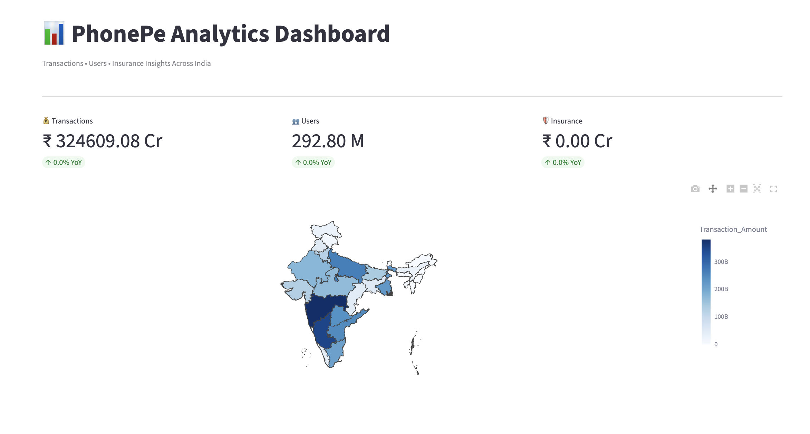
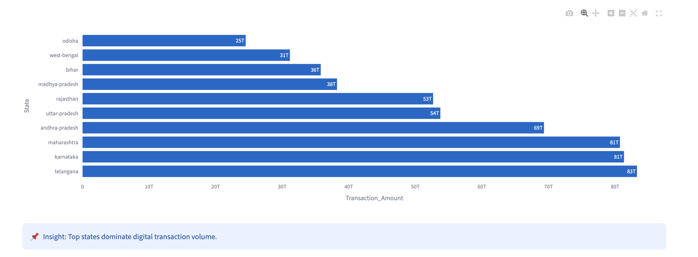
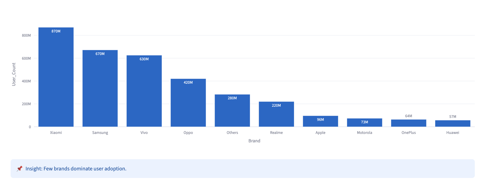
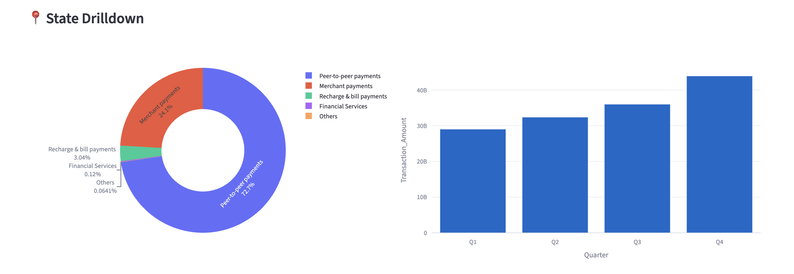

# 📊 PhonePe Data Analytics Dashboard

An interactive data analytics dashboard built using Streamlit to analyze PhonePe transactions, users, and insurance data across India.

---

## 🚀 Live App
🔗 [https://phonepe-dashboard-phkrczpvmg857dml-hqlugs.streamlit.app/
](https://phonepe-dashboard-phkrczpvmg857dmlhqlugs.streamlit.app/)
---

## 📸 Preview

---

## 🧠 Key Features

- 📍 State-wise transaction heatmap
- 📊 KPI metrics with Year-over-Year growth
- 📈 Transaction, User & Insurance trend analysis
- 🏆 Top states and brands insights
- 🔍 Automated analytical insights
- 🎯 State-level drilldown analytics
- 🌙 Dark mode support
- 📥 Downloadable dataset

---

## 🛠 Tech Stack

- Python  
- Streamlit  
- Pandas  
- Plotly  

---

## 💡 Project Overview

Built an end-to-end analytics dashboard to explore digital payment trends across India.  
The project focuses on transforming raw transactional data into meaningful insights using interactive visualizations, KPI tracking, and drill-down analysis.

---

## 🎯 What I Learned

- Handling real-world messy data (CSV formatting issues)
- Building deployable data apps
- Designing user-friendly dashboards
- Creating insights, not just charts

---

## 📌 Author

**Sriguhan**
